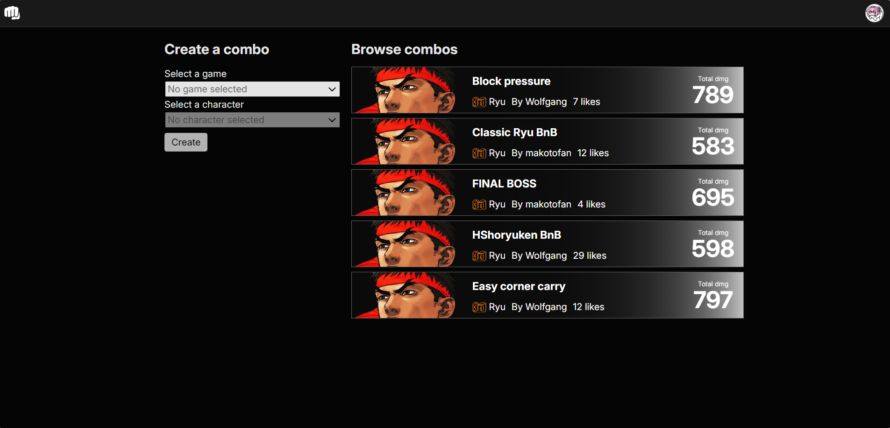
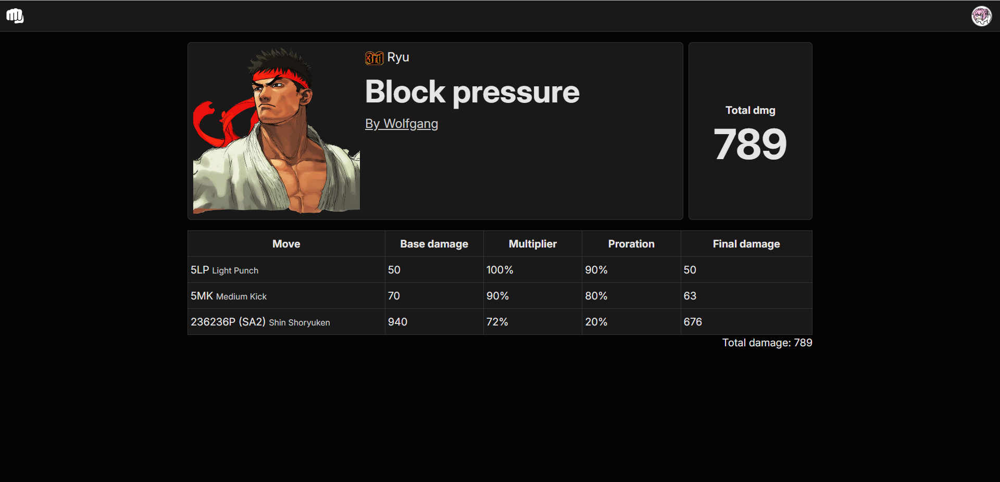
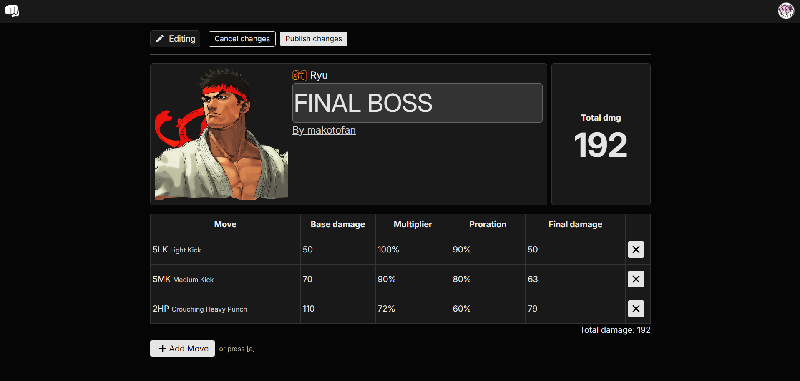
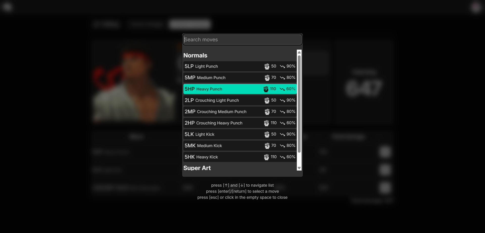

# FGCombos

FGCombos is a web app for creating and viewing combos for fighting games.

## Home page

There are two sections:

1. The create section, which has a small form. Here you can create a new combo for a given game and character (only if you are signed in).

2. The browse section, where recently published combos are listed. You can click on a combo to navigate to its corresponding page.

## Combo page

Features an overview of the combo. Below it is a list of the combo's moves with their info displayed in tabular fashion.

If you are viewing a combo you yourself created, you can enter an 'edit mode' by clicking the the 'edit' button in the upper page.

While in edit mode, you can delete combos from the list or change the combo's title.

In edit mode, you can open the move selection modal by clicking the 'add move' button towards the bottom of the page, or pressing a hotkey.

Here you can navigate the character's move list and add a move to the combo.

Changes are not saved automatically - if you're satisfied with your modified combo, click the 'publish changes' button in the top of the page.